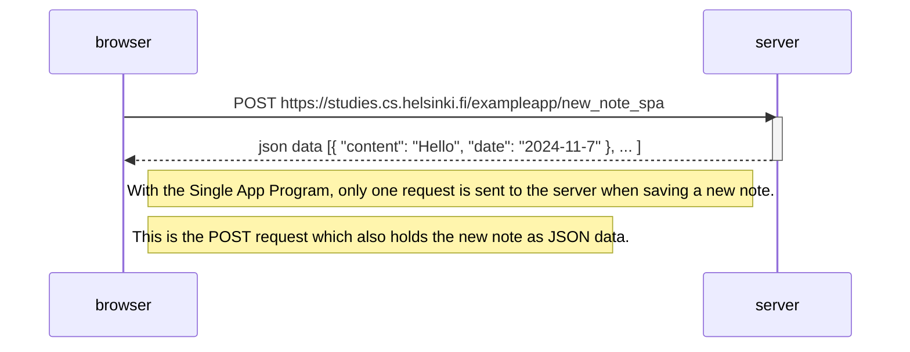

```mermaid
sequenceDiagram
    participant browser
    participant server

    browser->>server: POST https://studies.cs.helsinki.fi/exampleapp/new_note_spa
    activate server
    server-->>browser: json data [{ "content": "Hello", "date": "2024-11-7" }, ... ]
    deactivate server

    Note right of browser: With the Single App Program, only one request is sent to the server when saving a new note.
    Note right of browser: This is the POST request which also holds the new note as JSON data.
```